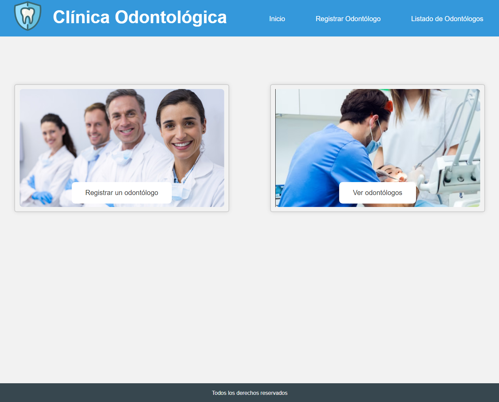
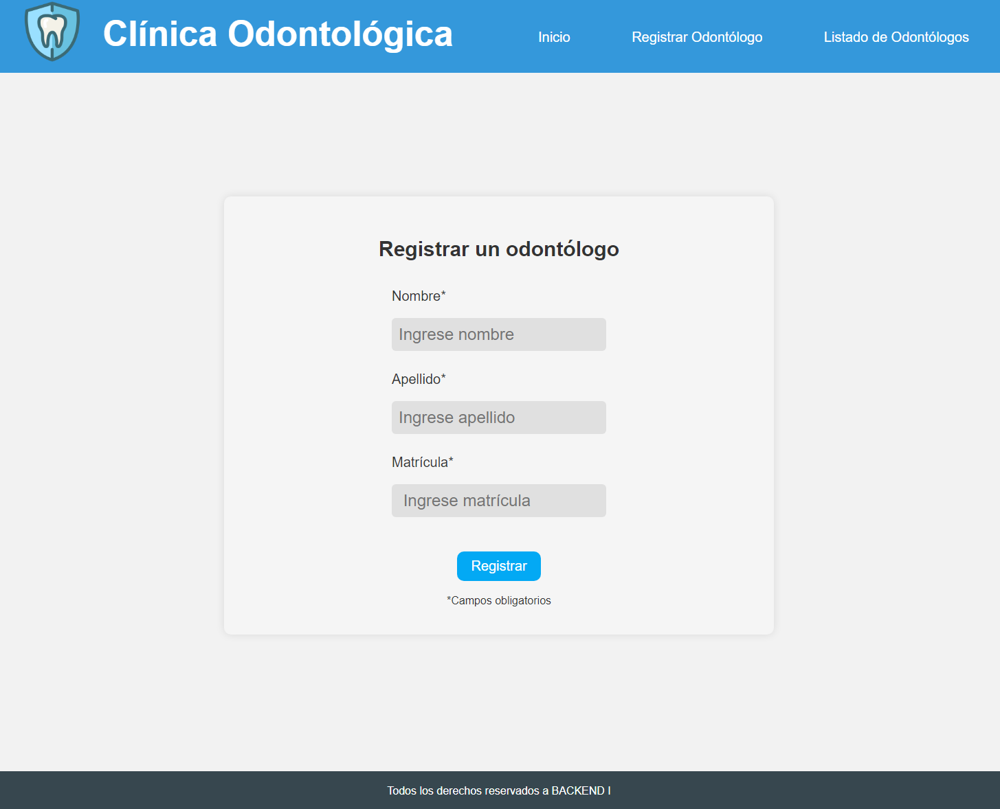
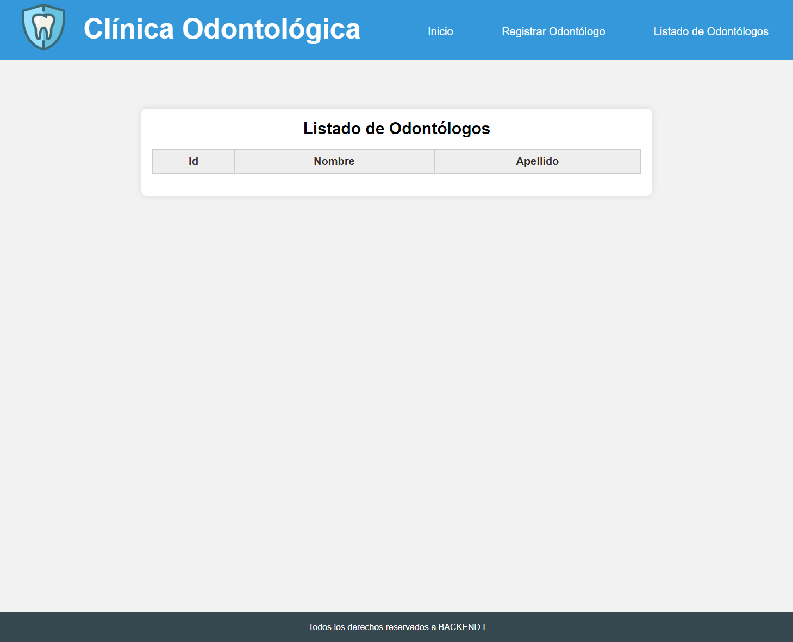

# Proyecto Clínica Odontológica

Este es nuestro proyecto final de Java con Spring Boot para el curso de Backend I.

Este proyecto implementa una aplicación para la gestión de odontólogos en una clínica odontológica, cumpliendo con los requerimientos del curso de Backend I.

## Imagenes del proyecto

###
### Pantalla Principal

### Formulario de Registro

### Listado de Odontologos

